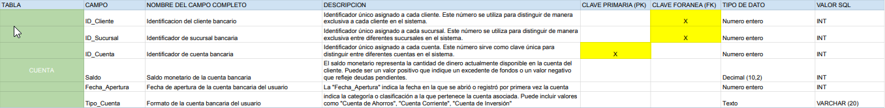

# Proyecto SQL creacion base de datos "Gestor Bancario"

### Introduccion:

En la actualidad, la eficiencia en la gestión de operaciones bancarias es esencial para la satisfacción del cliente y la integridad de la institución financiera. Un sistema de gestión bancaria efectivo no solo simplifica las transacciones diarias, sino que también asegura la seguridad y precisión de la información relacionada con clientes, cuentas y transacciones, elementos cruciales en el sector financiero.

Este documento proporciona una visión detallada de la base de datos diseñada y desarrollada para un proyecto de gestión bancaria a pequeña escala. El enfoque está dirigido a abordar desafíos específicos en el entorno financiero, buscando garantizar una gestión fluida y segura de la información. Aunque este proyecto se presenta a pequeña escala, su diseño y enfoque se alinean con las mejores prácticas observadas en sistemas de gestión bancaria a mayor escala.

### Objetivos:

Diseñar y desarrollar una base de datos eficiente para respaldar las operaciones diarias de una entidad bancaria a pequeña escala. La meta es centralizar información, optimizar la accesibilidad de datos, proporcionar seguridad en transacciones y simplificar el seguimiento de clientes, cuentas y transacciones. Aunque el proyecto es de menor escala, se busca reflejar principios esenciales de sistemas de gestión bancaria más grandes.

### Situacion problemática:

Este proyecto aborda esta situación problemática al diseñar una solución de base de datos que atienda específicamente las necesidades de una entidad bancaria más pequeña. Se busca superar los desafíos identificados, ofreciendo una gestión más fluida y segura de la información fundamental para las operaciones diarias.

### Modelo de Negocio:

La base de datos desarrollada respalda este modelo centralizando información clave, facilitando el seguimiento de clientes y sus transacciones, y estableciendo un entorno seguro para las operaciones financieras. Este enfoque busca mejorar la eficiencia operativa y brindar una experiencia bancaria integral a la clientela, consolidando así la posición de la entidad en el mercado financiero a pequeña escala.

### Diagrama de Entidad Relacion:


### Tablas:





### Scripts de creación:

```
-- Crear la tabla Clientes
CREATE TABLE Clientes (
    ID_Cliente INT AUTO_INCREMENT PRIMARY KEY,
    Nombre VARCHAR(50) NOT NULL,
    Apellido VARCHAR(50) NOT NULL,
    DNI VARCHAR(20) UNIQUE NOT NULL,
    Direccion VARCHAR(100) NOT NULL,
    Ciudad VARCHAR(50) NOT NULL,
    Codigo_Postal VARCHAR(10) NOT NULL,
    Telefono VARCHAR(20) NOT NULL,
    Genero VARCHAR(10) NOT NULL,
    Fecha_Nacimiento DATE NOT NULL
);


-- Crear la tabla de Cuentas
CREATE TABLE Cuentas (
    ID_Cuenta INT AUTO_INCREMENT PRIMARY KEY,
    ID_Cliente INT NOT NULL,
    ID_Sucursal INT NOT NULL,
    Saldo DECIMAL(10, 2) NOT NULL,
    Fecha_Apertura DATE NOT NULL,
    Tipo_Cuenta VARCHAR(50) NOT NULL,
    FOREIGN KEY (ID_Cliente) REFERENCES Clientes(ID_Cliente),
    FOREIGN KEY (ID_Sucursal) REFERENCES Sucursales(ID_Sucursal)
);


-- Crear la tabla de Transacciones
CREATE TABLE Transacciones (
    ID_Transaccion INT AUTO_INCREMENT PRIMARY KEY,
    Monto DECIMAL(10, 2) NOT NULL,
    Fecha_Transaccion DATETIME NOT NULL,
    ID_Cuenta_Origen INT NOT NULL,
    ID_Cuenta_Destino INT NOT NULL,
    ID_Empleado INT NOT NULL,
    Tipo_Transaccion VARCHAR(20) NOT NULL,
    FOREIGN KEY (ID_Cuenta_Origen) REFERENCES Cuentas(ID_Cuenta),
    FOREIGN KEY (ID_Cuenta_Destino) REFERENCES Cuentas(ID_Cuenta),
    FOREIGN KEY (ID_Empleado) REFERENCES Empleados(ID_Empleado)
);


-- Crear la tabla de Empleados
CREATE TABLE Empleados (
    ID_Empleado INT AUTO_INCREMENT PRIMARY KEY,
    Nombre VARCHAR(50) NOT NULL,
    Apellido VARCHAR(50) NOT NULL,
    DNI VARCHAR(20) UNIQUE NOT NULL,
    Direccion VARCHAR(100) NOT NULL,
    Telefono VARCHAR(20) NOT NULL,
    Cargo VARCHAR(50) NOT NULL,
    ID_Sucursal INT NOT NULL,
    FOREIGN KEY (ID_Sucursal) REFERENCES Sucursales(ID_Sucursal)
);


-- Crear la tabla de Sucursales
CREATE TABLE Sucursales (
    ID_Sucursal INT AUTO_INCREMENT PRIMARY KEY,
    Nombre VARCHAR(50) NOT NULL,
    Direccion VARCHAR(100) NOT NULL,
    Ciudad VARCHAR(50) NOT NULL,
    Codigo_Postal VARCHAR(10) NOT NULL,
    Telefono VARCHAR(20) NOT NULL,
    Gerente VARCHAR(100) NOT NULL
);


-- Crear la tabla de Tarjetas
CREATE TABLE Tarjetas (
    ID_Tarjeta INT AUTO_INCREMENT PRIMARY KEY,
    Numero_Tarjeta VARCHAR(16) UNIQUE NOT NULL,
    Fecha_Creacion DATE NOT NULL,
    Fecha_Vencimiento DATE NOT NULL,
    ID_Cliente INT NOT NULL,
    Tipo_Tarjeta VARCHAR(50) NOT NULL,
    Codigo_Seguridad VARCHAR(3) NOT NULL,
    FOREIGN KEY (ID_Cliente) REFERENCES Clientes(ID_Cliente)
);

```

### Script insert SQL

```
-- Insertar datos en la tabla Clientes (Datos ficticios, solo para propósitos de ejemplo)
INSERT INTO Clientes (Nombre, Apellido, DNI, Direccion, Ciudad, Codigo_Postal, Telefono, Genero, Fecha_Nacimiento)
VALUES
('Luis', 'Pérez', '30567890', 'Calle Mitre 123', 'Buenos Aires', '1000', '1123456789', 'Masculino', '1980-05-20'),
('Ana', 'García', '20678912', 'Avenida Libertador 456', 'Córdoba', '5000', '1133334567', 'Femenino', '1992-08-15'),
('Martín', 'Rodríguez', '40789123', 'Ruta Nacional 789', 'Rosario', '2000', '1144445678', 'Masculino', '1985-11-10'),
('Sofía', 'Fernández', '20891234', 'Calle San Martín 678', 'Mendoza', '3000', '1155556789', 'Femenino', '1998-03-25'),
('Javier', 'López', '30912345', 'Avenida Rivadavia 901', 'Salta', '4000', '1166667890', 'Masculino', '1990-12-12');

-- Insertar datos en la tabla Cuentas
INSERT INTO Cuentas (ID_Cliente, ID_Sucursal, Saldo, Fecha_Apertura, Tipo_Cuenta)
VALUES
(1, 1, 5000.00, '2022-01-15', 'Cuenta Corriente'),
(2, 2, 7500.50, '2022-02-20', 'Cuenta de Ahorros'),
(3, 3, 12000.75, '2022-03-10', 'Cuenta Corriente'),
(4, 4, 3000.25, '2022-04-05', 'Cuenta de Ahorros'),
(5, 5, 10000.00, '2022-05-12', 'Cuenta Corriente');

-- Insertar datos en la tabla Transacciones
INSERT INTO Transacciones (Monto, Fecha_Transaccion, ID_Cuenta_Origen, ID_Cuenta_Destino, ID_Empleado, Tipo_Transaccion)
VALUES
(500.00, '2022-01-20 08:30:00', 1, 2, 1, 'Transferencia'),
(120.50, '2022-02-05 12:45:00', 2, 3, 2, 'Depósito'),
(1000.75, '2022-03-15 16:20:00', 3, 4, 3, 'Transferencia'),
(50.25, '2022-04-02 09:10:00', 4, 5, 4, 'Retiro'),
(300.00, '2022-05-10 14:30:00', 5, 1, 5, 'Depósito');


-- Insertar datos en la tabla Empleados
INSERT INTO Empleados (Nombre, Apellido, DNI, Direccion, Telefono, Cargo, ID_Sucursal)
VALUES
('Carlos', 'González', '30678901', 'Avenida Belgrano 123', '1155551234', 'Gerente', 1),
('Ana', 'Rodríguez', '20789123', 'Calle San Martín 456', '1166662345', 'Cajero', 2),
('Martina', 'Gómez', '40891234', 'Ruta Nacional 789', '1133333456', 'Analista', 3),
('Javier', 'Fernández', '50912345', 'Calle Sarmiento 678', '1144444567', 'Cajero', 4),
('Sofía', 'López', '61023456', 'Avenida Rivadavia 901', '1177775678', 'Analista', 5);

-- Insertar datos en la tabla Sucursales
INSERT INTO Sucursales (Nombre, Direccion, Ciudad, Codigo_Postal, Telefono, Gerente)
VALUES
('Sucursal A', 'Calle Principal 123', 'Ciudad A', '12345', '123456789', 'Ana Rodriguez'),
('Sucursal B', 'Avenida Central 456', 'Ciudad B', '54321', '987654321', 'Carlos Gomez'),
('Sucursal C', 'Ruta Secundaria 789', 'Ciudad C', '67890', '555111222', 'Elena Fernandez'),
('Sucursal D', 'Calle Peatonal 987', 'Ciudad D', '98765', '999333777', 'Diego Torres'),
('Sucursal E', 'Avenida Transitada 654', 'Ciudad E', '45678', '444888222', 'Laura Martinez');

-- Insertar datos en la tabla Tarjetas
INSERT INTO Tarjetas (Numero_Tarjeta, Fecha_Creacion, Fecha_Vencimiento, ID_Cliente, Tipo_Tarjeta, Codigo_Seguridad)
VALUES
('1234567812345678', '2022-01-25', '2025-01-31', 1, 'Débito', '123'),
('2345678923456789', '2022-02-15', '2024-02-29', 2, 'Crédito', '456'),
('3456789034567890', '2022-03-05', '2023-03-31', 3, 'Débito', '789'),
('4567890145678901', '2022-04-10', '2025-04-30', 4, 'Crédito', '012'),
('5678901256789012', '2022-05-20', '2024-05-31', 5, 'Débito', '345');

```

### Create View SQL

La vista "VistaClientesCuentas" ha sido creada para proporcionar una perspectiva simplificada de la relación entre clientes y cuentas en el sistema de gestión bancaria. La vista presenta información específica de los clientes, incluyendo su ID, nombre, apellido y número de identificación (DNI), junto con detalles asociados a las cuentas bancarias, como el ID de la cuenta y el saldo disponible.

```
CREATE VIEW VistaClientesCuentas AS
SELECT
	cl.ID_Cliente,
    cl.Nombre,
    cl.Apellido,
    cl.DNI,
    cu.ID_Cuenta,
    cu.Saldo
FROM
	clientes cl
LEFT JOIN
	cuentas cu ON cl.ID_Cliente = cu.ID_Cliente;
```

La vista "VistaEmpleadosSucursales" ha sido creada para proporcionar una visión consolidada de la relación entre los empleados de la entidad bancaria y las sucursales en las que operan. La vista incluye detalles específicos de los empleados, como ID, nombre, apellido, DNI, dirección, teléfono y cargo, así como el nombre de la sucursal a la que están asignados.

```
CREATE VIEW VistaEmpleadosSucursales AS
SELECT
	e.ID_Empleado,
    e.Nombre,
    e.Apellido,
    e.DNI,
    e.Direccion,
    e.Telefono,
    e.Cargo,
    s.Nombre AS NombreSucursal
FROM
	empleados e
JOIN sucursales s ON e.ID_Sucursal = s.ID_Sucursal;
```

La vista "VistaTransaccionesDetalladas" proporciona una visión detallada de las transacciones registradas en el sistema de gestión bancaria. Incluye información clave como el ID de transacción, monto, fecha de la transacción, tipo de transacción, nombres de los clientes de origen y destino, así como el nombre del empleado asociado a la transacción.

```
CREATE VIEW VistaTransaccionesDetalladas AS
SELECT
	t.ID_Transaccion,
    t.Monto,
    t.Fecha_Transaccion,
    t.Tipo_Transaccion,
    c1.Nombre AS ClienteOrigen,
    c2.Nombre AS ClienteDestino,
    e.Nombre AS NombreEmpleado
FROM
	transacciones t
JOIN
	cuentas c1 ON t.ID_Cuenta_Origen = c1.ID_Cuenta
JOIN
	cuentas c2 ON t.ID_Cuenta_Destino = c2.ID_Cuenta
JOIN
	empleados e ON t.ID_Empleado = e.ID_Empleado;
```

La vista "VistaTransaccionesDetalladas" proporciona una visión detallada de las transacciones registradas en el sistema de gestión bancaria. Incluye información clave como el ID de transacción, monto, fecha de la transacción, tipo de transacción, nombres de los clientes de origen y destino, así como el nombre del empleado asociado a la transacción.

```
CREATE VIEW VistaTransaccionesDetalladas AS
SELECT
    t.ID_Transaccion,
    t.Monto,
    t.Fecha_Transaccion,
    t.Tipo_Transaccion,
    c1.Nombre AS ClienteOrigen,
    c2.Nombre AS ClienteDestino,
    e.Nombre AS NombreEmpleado
FROM
    Transacciones t
JOIN
    Cuentas co ON t.ID_Cuenta_Origen = co.ID_Cuenta
JOIN
    Cuentas cd ON t.ID_Cuenta_Destino = cd.ID_Cuenta
JOIN
    Clientes c1 ON co.ID_Cliente = c1.ID_Cliente
JOIN
    Clientes c2 ON cd.ID_Cliente = c2.ID_Cliente
JOIN
    Empleados e ON t.ID_Empleado = e.ID_Empleado;
```

La vista "VistaTarjetasClientesDetallada" ofrece una perspectiva detallada de la relación entre las tarjetas bancarias y los clientes en el sistema. Incluye información clave como el ID de tarjeta, número de tarjeta, fechas de creación y vencimiento, así como los nombres y apellidos de los clientes asociados a cada tarjeta.

```
CREATE VIEW VistaTarjetasClientesDetallada AS
SELECT
    t.ID_Tarjeta,
    t.Numero_Tarjeta,
    t.Fecha_Creacion,
    t.Fecha_Vencimiento,
    c.Nombre,
    c.Apellido
FROM
    Tarjetas t
JOIN
    Clientes c ON t.ID_Cliente = c.ID_Cliente;
```

### Create Functions SQL

La función "RealizarTransaccion" se ha diseñado para facilitar la realización de transacciones financieras en el sistema bancario. Esta función toma como parámetros el monto de la transacción, los IDs de las cuentas de origen y destino, el ID del empleado involucrado y el tipo de transacción.

```
CREATE FUNCTION RealizarTransaccion(
    Monto DECIMAL(10, 2),
    IDCuentaOrigen INT,
    IDCuentaDestino INT,
    IDEmpleado INT,
    TipoTransaccion VARCHAR(20)
) RETURNS INT DETERMINISTIC READS SQL DATA
BEGIN
    -- Insertar la transacción
    INSERT INTO Transacciones (Monto, Fecha_Transaccion, ID_Cuenta_Origen, ID_Cuenta_Destino, ID_Empleado, Tipo_Transaccion)
    VALUES (Monto, NOW(), IDCuentaOrigen, IDCuentaDestino, IDEmpleado, TipoTransaccion);

    -- Actualizar saldos
    UPDATE Cuentas SET Saldo = Saldo - Monto WHERE ID_Cuenta = IDCuentaOrigen;
    UPDATE Cuentas SET Saldo = Saldo + Monto WHERE ID_Cuenta = IDCuentaDestino;

    RETURN LAST_INSERT_ID();
END //
```

La función "ObtenerSaldo" ha sido creada para obtener el saldo actual de una cuenta específica en el sistema bancario. Esta función toma como parámetro el ID de la cuenta (IDCuenta) y retorna el saldo asociado a esa cuenta.

```
DELIMITER //
CREATE FUNCTION ObtenerSaldo(IDCuenta INT) RETURNS DECIMAL(10, 2) DETERMINISTIC READS SQL DATA
BEGIN
    DECLARE saldo DECIMAL(10, 2);
    SELECT Saldo INTO saldo FROM Cuentas WHERE ID_Cuenta = IDCuenta;
    RETURN saldo;
END //

```

### Store Procedures

Este procedimiento almacenado (ObtenerInfoClienteCuentas) ha sido creado para obtener información detallada sobre un cliente y sus cuentas asociadas. El procedimiento toma como parámetro el ID del cliente (p_IDCliente) y devuelve una selección de datos relevantes desde las tablas Clientes y Cuentas.

```
DELIMITER //
CREATE PROCEDURE ObtenerInfoClienteCuentas(IN p_IDCliente INT)
BEGIN
    SELECT
        c.Nombre,
        c.Apellido,
        c.DNI,
        cc.ID_Cuenta,
        cc.Saldo,
        cc.Fecha_Apertura,
        cc.Tipo_Cuenta
    FROM Clientes c
    JOIN Cuentas cc ON c.ID_Cliente = cc.ID_Cliente
    WHERE c.ID_Cliente = p_IDCliente;
END //

CALL ObtenerInfoClienteCuentas(1); 
```

Este procedimiento almacenado (ActualizarDireccionEmpleado) ha sido diseñado para actualizar la dirección de un empleado en la tabla Empleados. El procedimiento toma dos parámetros de entrada: p_IDEmpleado que representa el ID del empleado que se va a actualizar, y p_NuevaDireccion que representa la nueva dirección que se asignará al empleado.

```
DELIMITER //
CREATE PROCEDURE ActualizarDireccionEmpleado(IN p_IDEmpleado INT, IN p_NuevaDireccion VARCHAR(100))
BEGIN
    UPDATE Empleados SET Direccion = p_NuevaDireccion WHERE ID_Empleado = p_IDEmpleado;
END //

CALL ActualizarDireccionEmpleado(1, 'Pellegrini 4890');
```

Este procedimiento almacenado (ObtenerEmpleadosPorSucursal) ha sido creado para obtener información específica sobre los empleados de una sucursal determinada. El procedimiento toma un parámetro de entrada, p_ID_Sucursal, que representa el ID de la sucursal para la cual se desea obtener la información de empleados.

```
DELIMITER //

CREATE PROCEDURE ObtenerEmpleadosPorSucursal(IN p_ID_Sucursal INT)
BEGIN
    SELECT Nombre, Apellido, Cargo
    FROM Empleados
    WHERE ID_Sucursal = p_ID_Sucursal;
END //

call ObtenerEmpleadosPorSucursal(2);
```

### Triggers

Este trigger (log_cambios_clientes) se ha diseñado para registrar cambios en la tabla Clientes antes de que se realice una operación de actualización. Su propósito principal es capturar y almacenar información sobre las modificaciones realizadas en las columnas Nombre y Apellido de la tabla Clientes en la tabla LogCambiosClientes. La información registrada incluye el ID del cliente afectado, el nombre del campo modificado, el valor antiguo y nuevo, el usuario que realizó la operación, y la fecha y hora en que se llevó a cabo la actualización.

```
DELIMITER //
CREATE TRIGGER log_cambios_clientes
BEFORE UPDATE ON Clientes
FOR EACH ROW
BEGIN
    IF NEW.Nombre != OLD.Nombre THEN
        INSERT INTO LogCambiosClientes (ID_Cliente, NombreCampoModificado, ValorAntiguo, ValorNuevo, Usuario, Fecha, Hora)
        VALUES (NEW.ID_Cliente, 'Nombre', OLD.Nombre, NEW.Nombre, CURRENT_USER(), CURDATE(), CURTIME());
    END IF;

    IF NEW.Apellido != OLD.Apellido THEN
        INSERT INTO LogCambiosClientes (ID_Cliente, NombreCampoModificado, ValorAntiguo, ValorNuevo, Usuario, Fecha, Hora)
        VALUES (NEW.ID_Cliente, 'Apellido', OLD.Apellido, NEW.Apellido, CURRENT_USER(), CURDATE(), CURTIME());
    END IF;

    -- Agregar más bloques IF para otras columnas si es necesario
END //
DELIMITER ;
```
Este trigger (log_cambios_cuentas) se activa automáticamente después de cada operación de actualización en la tabla Cuentas. Su objetivo es registrar cambios en la tabla LogCambiosCuentas para mantener un historial de modificaciones en las cuentas bancarias. Este registro incluye detalles como el ID de la cuenta afectada, el saldo antiguo y nuevo, el usuario que realizó la operación, y la fecha y hora en que se llevó a cabo la actualización.

```
DELIMITER //
-- Crear un trigger que se activará después de una actualización en la tabla Cuentas
CREATE TRIGGER log_cambios_cuentas
AFTER UPDATE ON Cuentas
FOR EACH ROW
BEGIN
    -- Insertar una fila en LogCambiosCuentas después de cada actualización
    -- Capturar información sobre el usuario, fecha y hora de la operación
    INSERT INTO LogCambiosCuentas (ID_Cuenta, SaldoAntiguo, SaldoNuevo, Usuario, Fecha, Hora)
    VALUES (
        NEW.ID_Cuenta,         -- Nuevo valor del ID_Cuenta
        OLD.Saldo,             -- Saldo antiguo
        NEW.Saldo,             -- Nuevo saldo
        CURRENT_USER(),        -- Usuario que realiza la operación
        CURDATE(),             -- Fecha actual
        CURTIME()              -- Hora actual
    );
END //
```
### Creacion de Usuarios

Este script SQL se utiliza para crear un usuario llamado 'usuario_lectura' con permisos limitados a solo lectura en la base de datos 'gestor_bancario'. El usuario solo podrá realizar operaciones de lectura (consultas) y no tendrá permisos para realizar modificaciones en la base de datos.

```
-- Crear usuario solo con permisos de lectura
CREATE USER 'usuario_lectura'@'localhost' IDENTIFIED BY 'contraseña_lectura';
GRANT SELECT ON gestor_bancario.* TO 'usuario_lectura'@'localhost';

SHOW GRANTS FOR 'usuario_lectura'@'localhost';

SELECT user, host FROM mysql.user WHERE user = 'usuario_lectura';
```

Este script SQL se utiliza para crear un usuario llamado 'usuario_modificacion' con permisos de lectura, inserción y modificación en la base de datos 'gestor_bancario'. El usuario puede realizar consultas (SELECT), insertar nuevos registros (INSERT) y actualizar registros existentes (UPDATE). Estos permisos le permiten realizar operaciones completas de manipulación de datos en la base de datos, incluida la capacidad de modificar registros y agregar nuevos datos.

```
-- Crear usuario con permisos de lectura, insercion y modificacion
CREATE USER 'usuario_modificacion'@'localhost' IDENTIFIED BY 'contraseña_modificacion';
GRANT SELECT,INSERT,UPDATE ON gestor_bancario.* TO 'usuario_modificacion'@'localhost';

SHOW GRANTS FOR 'usuario_modificacion'@'localhost';

SELECT user, host FROM mysql.user where user = 'usuario_modificacion';
```

Este script SQL se utiliza para revocar el permiso DELETE de ambos usuarios, 'usuario_lectura' y 'usuario_modificacion', en la base de datos 'gestor_bancario'. Después de ejecutar este script, ninguno de estos usuarios podrá eliminar registros de la base de datos.

```
REVOKE DELETE ON gestor_bancario.* FROM 'usuario_lectura'@'localhost';
REVOKE DELETE ON gestor_bancario.* FROM 'usuario_modificacion'@'localhost';
```

### Herramientas y Tecnologias

- **Google Sheets:**
  - _Descripción:_ Utilizado para la gestión y análisis de datos relacionados con el sistema de gestión bancaria.

- **MySQL Workbench:**
  - _Descripción:_ Herramienta visual para el modelado de bases de datos, desarrollo SQL y administración de MySQL.

- **Git y GitHub:**
  - _Descripción:_ Sistema de control de versiones distribuido (Git) y plataforma para el control de versiones colaborativo (GitHub).


### Futuras lineas 

- **Generación Automática de Informes Mensuales: **

  - _Automatiza la generación de informes mensuales para clientes.

- ** Sistema de Alertas por Saldo Bajo: **
  - _Esto proporciona un mecanismo automático para alertar sobre saldos bajos.
